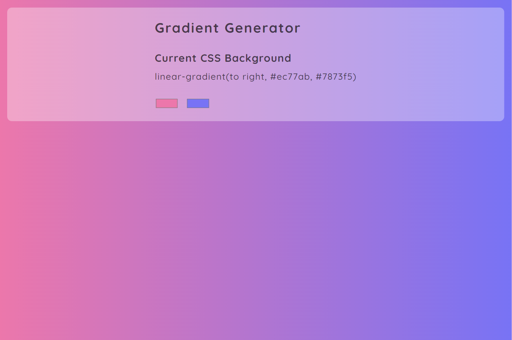
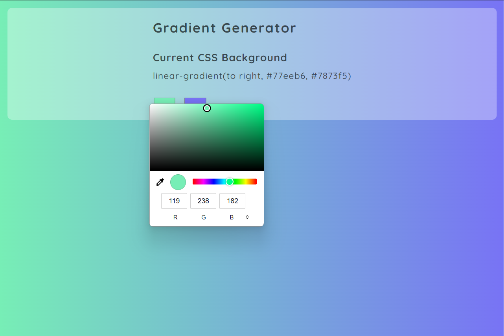
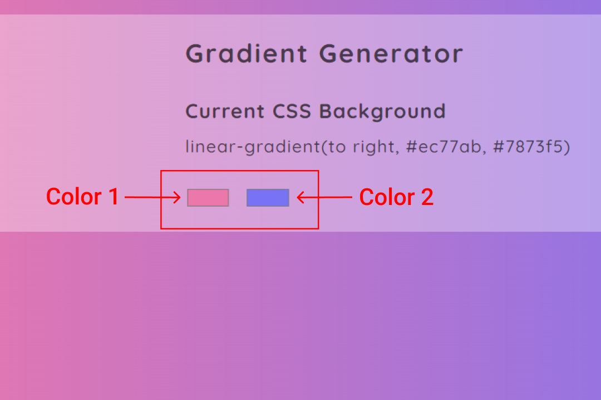
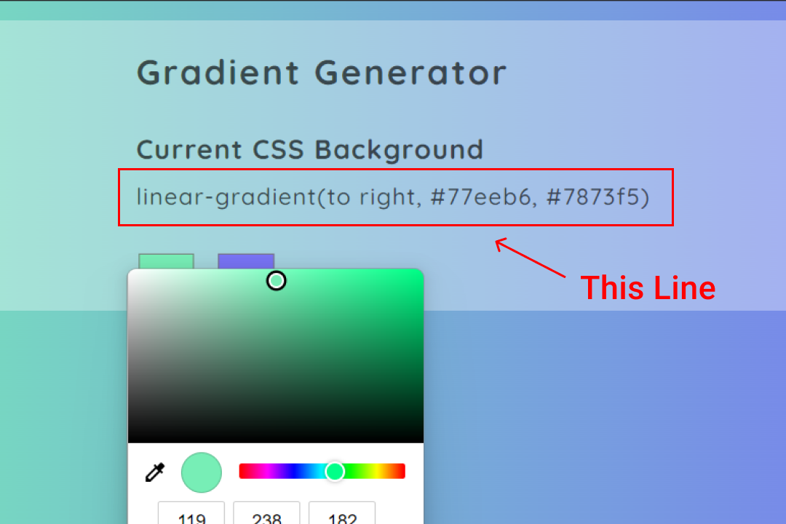

# gradient-background-generator

This is a web page that is created in HTM, CSS and JS. This page is created with the concept of DOM manipulation with JS.

### that's cool :cherry_blossom:

By using this web page you can generate cool looking backgrounds for your designs in real time.

## screen shots :camera_flash:

## guide :sparkles:

- [x] By clicking on any of the two-color buttons, a color selection screen appears from where you can change the color of a specific side.

 

- [x] If you want to use it in your CSS, copy that line and put it into your CSS.

## site link :link:

By [Clicking Me](https://msarmadqadeer.github.io/gradient-background-generator/) you'll see the live version of this project. If you like the project, star ⭐ the repo!
